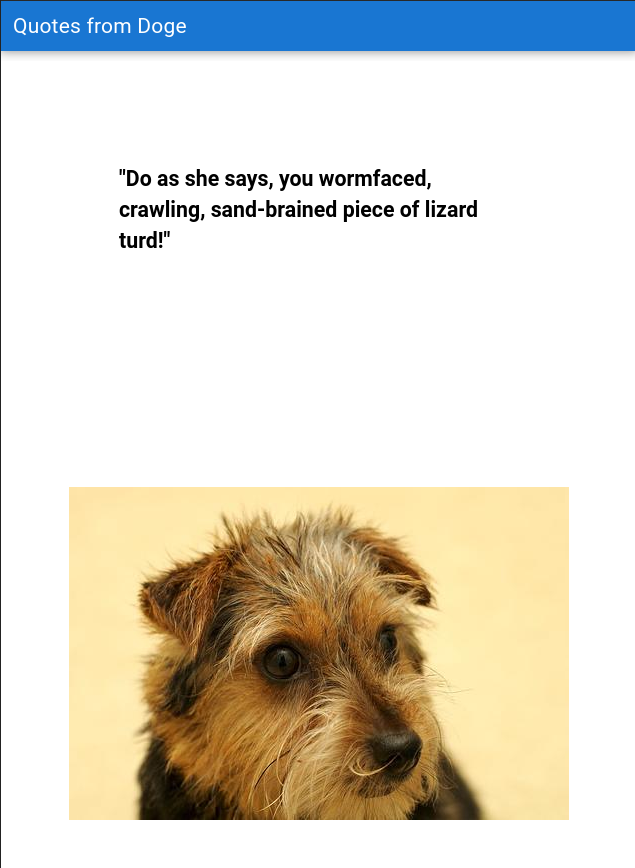

# Doge Speaks (dogquotes)

Doge, speaking

If set up correctly this application shows a Dune quote with an image of a random dog. 

This is funny and you should experience it at least thrice. 

For some reason Firefox whines about CORS no matter what one says on the other end so screw them and use [Nyxt](https://github.com/atlas-engineer/nyxt) instead, because hackableness.



## Install the dependencies
```bash
npm install
```

### Start the app in development mode (hot-code reloading, error reporting, etc.)
```bash
php -S localhost:9090 doge.php

quasar dev
```
